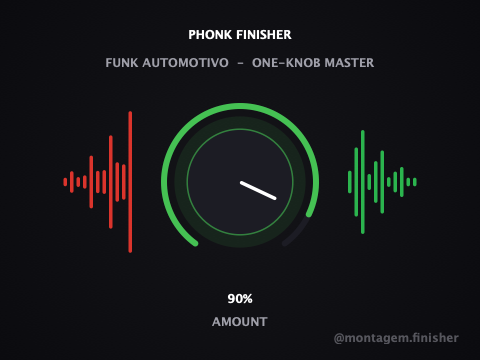

# Phonk Finisher

**A one-knob "genre finisher" audio plugin for funk automotivo / phonk producers.**

Drop in a raw 808, kick, or loop, turn the single `Amount` knob, and get a driven,
tonally-shaped, level-matched sound — no mixing knowledge required. Built with
[JUCE](https://juce.com/), ships as VST3 / AU / Standalone on macOS and Windows.

<p align="center">
  
</p>

<p align="center">
  <strong><a href="https://github.com/nabsei/phonk-finisher/releases/latest">⬇ Download the latest beta</a></strong> — macOS and Windows, free.
</p>

<p align="center">
  Also listed on <a href="https://www.kvraudio.com/product/phonk-finisher-by-montagemfinisher">KVR Audio</a> and <a href="https://montagemfinisher.itch.io/phonk-finisher">itch.io</a>.
</p>

## Why one knob

Most effect plugins hand you five to ten parameters and assume you know how to use
them. Phonk Finisher is built for a specific audience — funk automotivo / phonk
producers who want a sound that already matches the genre, fast — so every
parameter that would normally be exposed (drive, tone, output limiting) is instead
derived from a single `Amount` macro. Turn it up, it gets more "finished."

## Status

Early-stage / actively developed. Signal chain and calibration are still being
tuned against reference material — see [Open items](#open-items) below.

This repository shows the plugin's **architecture**: JUCE plugin wrapper, custom
UI, parameter handling, state save/load. The exact DSP calibration used in the
shipped/tested build (filter topology, envelope-follower time constants, gain
staging tuned against reference audio) is simplified in `Source/FinisherProcessor.cpp`
here — that tuning is the actual product, not open source at this stage.

## Features

- Single macro parameter (`Amount`) driving the whole signal chain
- Custom dark-themed UI: the knob's glow and arc shift from red to green as the
  effect intensifies, matching the "before / after" visual identity used in demos
- Denormal-safe processing and parameter smoothing (no zipper noise when
  automating or turning the knob live)
- Builds as **VST3**, **AU** (passes `auval` validation), and a **Standalone** app

## Tech stack

- C++17, [JUCE](https://github.com/juce-framework/JUCE) (audio processing + UI)
- CMake + Ninja

## Building

```bash
git clone --depth 1 https://github.com/juce-framework/JUCE.git libs/JUCE
cmake -B build -G Ninja -DCMAKE_BUILD_TYPE=Release
cmake --build build
```

This produces a VST3, an AU component, and a standalone app under
`build/PhonkFinisher_artefacts/Release/`, and installs the plugin formats into
your system's plugin folders automatically (`COPY_PLUGIN_AFTER_BUILD`).

## Project structure

```
Source/
  PluginEntry.cpp        JUCE plugin entry point
  FinisherProcessor.*     AudioProcessor: parameters, DSP, state save/load
  PluginEditor.*           Custom UI (rotary knob, brand colors, layout)
  FinisherLookAndFeel.h    Custom LookAndFeel for the rotary control
CMakeLists.txt
```

## Open items

- [ ] Code signing / notarization for both macOS and Windows (current
      beta requires a one-time manual step on first install)
- [ ] Mono bus support (currently stereo in/out only)
- [ ] Automated test suite

## License

MIT — see [LICENSE](LICENSE). Covers the architecture shown in this
repository (JUCE plugin wrapper, UI, build setup). As noted above, the
DSP calibration used in the actual product is not included here.
